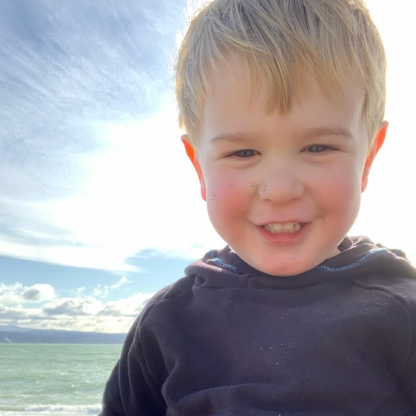
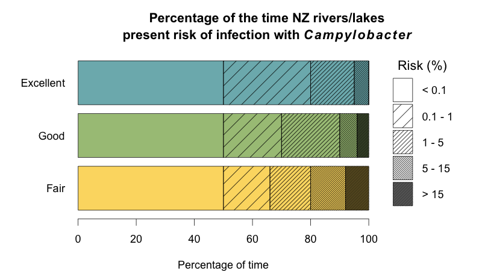
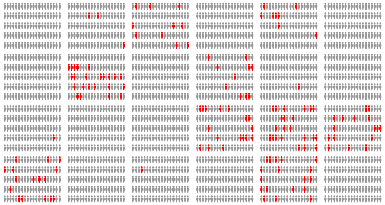
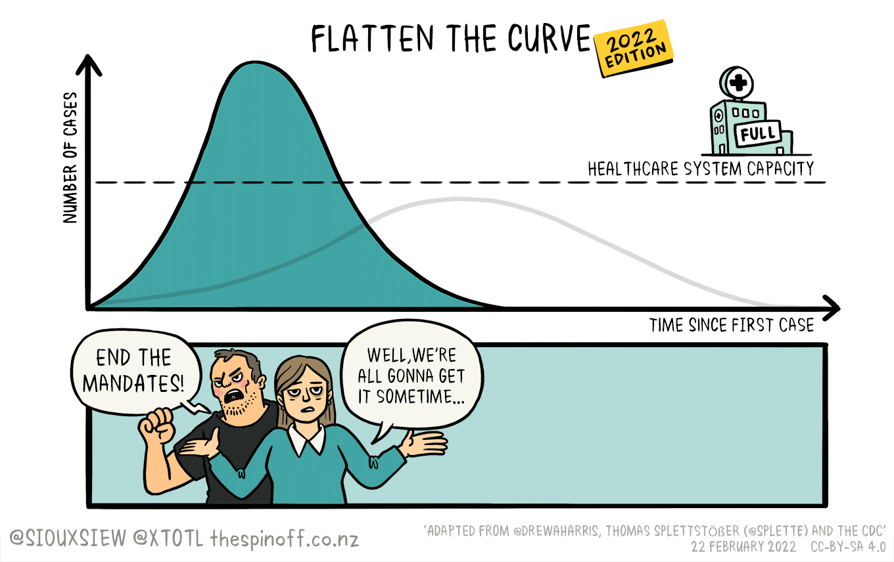
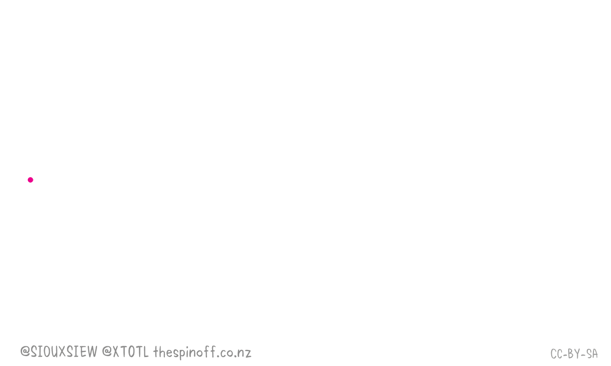
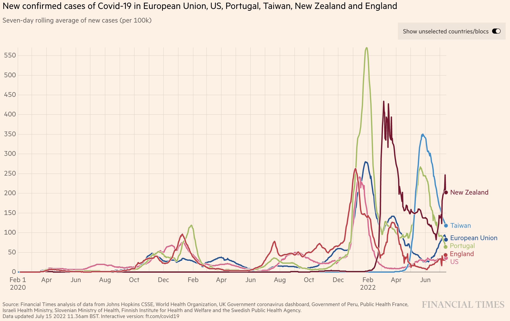
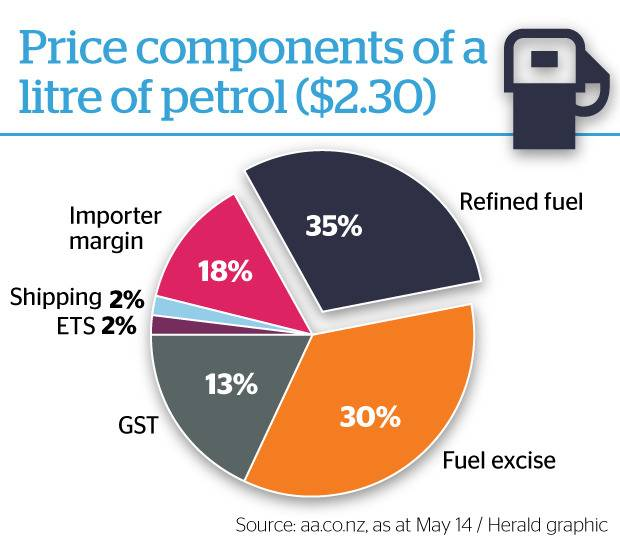
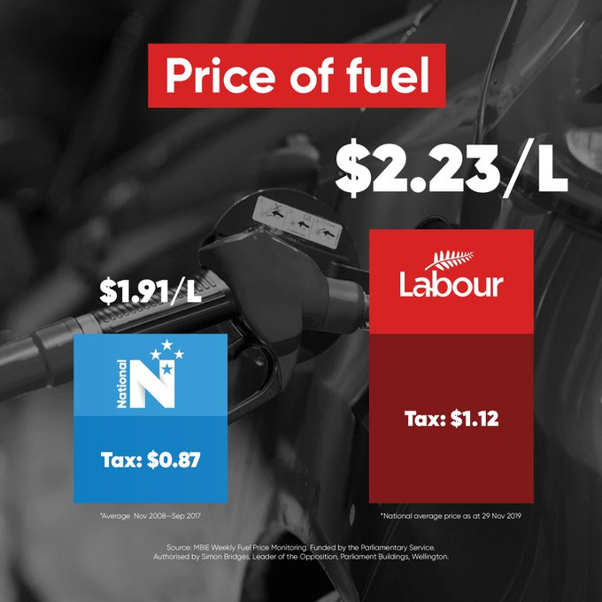

```{r setup, include=FALSE}
library(tidyverse)
library(palmerpenguins)
penguins = na.omit(penguins)
#data(package = 'palmerpenguins')
knitr::opts_chunk$set(echo = TRUE)
knitr::opts_chunk$set(fig.dim=c(4.8, 4.5), fig.retina=2, out.width="100%")
```

class: middle, inverse

## Welcome to Statistics

---

## Teaching team

In order of appearance:

Jonathan Marshall         |  Jonathan Godfrey          | Mat Pawley
--------------------------|----------------------------|--------------------------
j.c.marshall@massey.ac.nz |   a.j.godfrey@massey.ac.nz | m.pawley@massey.ac.nz
Manawatu ScB3.17          |   Manawatu ScB3.15         | Albany MS3.08

---

## Who am I?

<div align="center">
<span class='inline'>
  <a href="http://instagram.com/monstamini"></a>
  
  
</span>
</div>

- I'm a statistician with two pets and one kid.

- Interested in statistical modelling of disease.

- Two main areas: [spatio-temporal modelling](https://jmarshallnz.github.io/talks/nzsa2016), and [source attribution](https://jmarshallnz.github.io/talks/OHA2019).

---

## Topic A: The way we work

- Learning R/RStudio.

- Charting and visualisation with `ggplot2`.

- Reproducible analysis with `rmarkdown`.

- Data wrangling with `dplyr`.

- The importance of tidy data.

---

## Software

We use R via RStudio. https://www.r-project.org

R was developed in Auckland, by [Ross Ihaka](https://en.wikipedia.org/wiki/Ross_Ihaka) and [Robert Gentleman](https://en.wikipedia.org/wiki/Robert_Gentleman_(statistician%29), but now there are a cast of thousands.

It is programming language that is built with statistical analyses in mind.

You will **learn to write code** to clean data, produce charts, and build models.

We interact with R via the RStudio front-end: https://rstudio.com

Both are free, and you should install them on your computer. Instructions are here:

https://r-resources.massey.ac.nz/help/usingrin161.122.html

---

## Getting help

- Use the stream forums to ask for help.

- Use the [Discord channel](https://discord.gg/Mzk7fUk) to ask for help.

- We encourage you to help your classmates on stream (or in workshops) as well.

- Try and help us (and your classmates) help you: e.g. if you have an R issue, copy your code and the error so we can spot the problem.

- Google is super useful! Include "R" or "RStudio" or maybe the name of the package "ggplot" or "dplyr" in your query.

- Check the date of the google responses: older results might well be out of date.

---

class: middle, inverse

# Demo: What do you think statistics is?

https://forms.gle/8F5SDpCrmsuWRCfQ6

---

## What do I think statistics is?

Three words I might use to describe what we're going to do in 161.122:

- Charts

- Data

- Models

---

## What do I think statistics is?

Three words I might use to describe what we're going to do in 161.122:

- **Charts** Telling stories with data. Variation matters.

- **Data** Understanding data limitations. Importance of randomness.

- **Models** Quantifying uncertainty, inferring relationships, making decisions.

**It's about quantifying evidence in the face of uncertainty.**

---

class: middle, inverse

# Charts

---

## Freshwater quality in New Zealand: Swimmable?



---

## Freshwater quality in New Zealand: Swimmable?



---

## Everything both causes and prevents cancer

```{r, echo=FALSE, fig.dim = c(7,4), out.width="80%"}
cancer <- read.csv(here::here("data/schoenfeld_ioannidis.csv"))
ggplot(cancer) + geom_vline(xintercept=1, col='grey50') + geom_point(aes(x=rel_risk, y=Food), col = 'darkred', alpha=0.7, size=2) + scale_x_log10() +
  theme_bw() + labs(x = "Relative risk for cancer", caption="J. Schoenfeld and J. Ioannidis, American Journal of Clinical Nutrition 2013") +
  theme(axis.title.y = element_blank())
```

http://ajcn.nutrition.org/content/97/1/127.long

---

## Toby Morris and Siouxsie Wiles



---

## Toby Morris and Siouxsie Wiles



---



https://ig.ft.com/coronavirus-chart/
---

## New York Times needle: 2016 US election


---

## Risk of campylobacteriosis in the Manawatū

<center>
   <video src='https://jmarshallnz.github.io/talks/video/spatial_fit.mp4' width='960px' loop='true' autoplay='true'/>
</center>

---

## Risk of campylobacteriosis in Palmerston North

<center>
   <video src='https://jmarshallnz.github.io/talks/video/spatial_palmy_fit.mp4' width='960px' loop='true' autoplay='true'/>
</center>

---

.left-code[

## Bad charts are bad

You can monitor petrol prices here:

https://www.mbie.govt.nz/building-and-energy/energy-and-natural-resources/energy-statistics-and-modelling/energy-statistics/weekly-fuel-price-monitoring/
]



---

.left-code[
## Ruled OK by the advertising standard's authority

- Comparing a long term average to a single day

- Bars are obviously not in proportion to values.

- Tax proportion in both plots is incorrect.
]

.right-plot[

]
---

## General rules

- Don't mislead.

- Compare like with like.

- Axes should start at zero where bar height represents values.

- Ensure you show where the data are from and how you generated the chart.

- Show variation or uncertainty where you can.

---

.left-code-wide[
```{r, echo=FALSE}

```

https://www.nzherald.co.nz/nz/more-students-cheat-in-exams-and-most-are-in-auckland/L2APF64NPHLMPFCI2O56CJ7JNI/
]

.right-plot-narrow[
```{r, message=FALSE, echo=FALSE}
yearly <- read_csv(here::here("stories/ncea_cheats/ncea_cheats_yearly.csv"))
cheats <- read_csv(here::here("stories/ncea_cheats/ncea_cheats.csv"))
yearly %>% knitr::kable()
```
]

---

.left-code-wide[
```{r, echo=FALSE}

```

https://www.nzherald.co.nz/nz/more-students-cheat-in-exams-and-most-are-in-auckland/L2APF64NPHLMPFCI2O56CJ7JNI/
]

.right-plot-narrow[
```{r, message=FALSE, echo=FALSE}
cheats %>% select(Region, Cheats) %>%
  knitr::kable()
```
]

---

.left-code-wide[
```{r, echo=FALSE}

```

https://www.nzherald.co.nz/nz/more-students-cheat-in-exams-and-most-are-in-auckland/L2APF64NPHLMPFCI2O56CJ7JNI/
]

.right-plot-narrow[
```{r, message=FALSE, echo=FALSE}
cheats %>%
  knitr::kable()
```
]

---

.left-code-wide[
```{r, echo=FALSE}

```

https://www.nzherald.co.nz/nz/more-students-cheat-in-exams-and-most-are-in-auckland/L2APF64NPHLMPFCI2O56CJ7JNI/
]

.right-plot-narrow[
```{r, message=FALSE, echo=FALSE}
cheats %>% mutate(`Cheats/1000` = round(Cheats/Students*1000, 2)) %>%
  select(Region, `Cheats/1000`) %>%
  knitr::kable()
```
]

---


class: middle, inverse

# `ggplot2`

---

## What is `ggplot2`

- `ggplot2` is a package for R by Hadley Wickham

- Based on the **grammar of graphics**

- Uses a consistent 'language' to produce different plots

- Very flexible, particularly for complex plots

- Everything is editable

- **BUT: Quite a lot to type!**

---

.left-code[
## Quite a lot to type
```{r quakes, eval=FALSE}
ggplot(data = quakes) +
  geom_point(
    mapping = aes(
      x = long,
      y = lat
    )
  )
```
]

.right-plot[
```{r ref.label="quakes", echo=FALSE}
```
]

---

## Helpful resources

- The `ggplot2` cheatsheet in RStudio: https://rstudio.org/links/data_visualization_cheat_sheet

- The `ggplot2` book: https://ggplot2-book.org/

- The `ggplot2` page on tidyverse.org: https://ggplot2.tidyverse.org/

- Search stackoverflow.com: https://stackoverflow.com/questions/tagged/ggplot2?sort=faq

---

## What is the grammar of graphics?

Basic idea: Specify plot building blocks and combine them to produce a plot.

- Data. Always use a `data.frame`

- Aesthetics. Mapping of your data to a plot aesthetic (position/colour/fill/shape)

- Geometries. Points/Lines/Boxplots/Histograms etc

- Statistical transformations

- Scales and coordinate systems

- Position adjustments

- **Faceting** (small multiple plots)

---

## Example: Penguins!

Data today were collected by [Dr Kristen Gorman](https://www.uaf.edu/cfos/people/faculty/detail/kristen-gorman.php) and the [Palmer Station, Antartica Long Term Ecological Research Network](https://pal.lternet.edu/).

This is available for R in the `palmerpenguins` package.

```{r}
library(palmerpenguins)
penguins
```

---

.left-code[
```{r peng1, eval=FALSE}
ggplot(data = penguins) +
  geom_point(
    mapping = aes(
      x = flipper_length_mm,
      y = body_mass_g
      )
    )
```
]

.right-plot[
```{r ref.label="peng1", echo=FALSE}
```
]
---

## Recipe

To create a chart we need to:

- Tell R we want a plot with `ggplot()`.

- Tell `ggplot` what data we are plotting with `data=penguins`.

- Choose what type of chart we want by adding a layer (geometry), e.g. `geom_point`.

- Tell the geometry how to map from visual content/features to data with `mapping = aes()`.

All our charts will follow the same basic recipe. We might just add a few more ingredients!

---

.left-code[
## Recipe
```{r peng2, eval=FALSE}
ggplot(data = penguins) + #<<
  geom_point(
    mapping = aes(
      x = flipper_length_mm,
      y = body_mass_g
      )
    )
```
Tell `ggplot` what data we want to plot.
]

.right-plot[
```{r ref.label="peng2", echo=FALSE}
```
]

---

.left-code[
## Recipe
```{r peng3, eval=FALSE}
ggplot(data = penguins) +
  geom_point( #<<
    mapping = aes(
      x = flipper_length_mm,
      y = body_mass_g
      )
    ) #<<
```
Choose the type of chart we want.
]

.right-plot[
```{r ref.label="peng3", echo=FALSE}
```
]

---

.left-code[
## Recipe
```{r peng4, eval=FALSE}
ggplot(data = penguins) +
  geom_point(
    mapping = aes( #<<
      x = flipper_length_mm, #<<
      y = body_mass_g #<<
      ) #<<
    )
```

Map plot features to data features.
]

.right-plot[
```{r ref.label="peng4", echo=FALSE}
```
]

---

.left-code[
## Mapping colour to data
```{r peng7, eval=FALSE}
ggplot(data = penguins) +
  geom_point(
    mapping = aes(
      x = flipper_length_mm,
      y = body_mass_g,
      colour = species #<<
      )
    )
```

- Automatically adds a guide or legend.

- `x` and `y` have guides too (the axes).
]

.right-plot[
```{r, ref.label="peng7", echo=FALSE}
```
]

---

## Remember the Recipe!

- Tell R we want a plot with `ggplot()`.

- Tell `ggplot` what data we are plotting with `data=penguins`.

- Choose what type of chart we want by adding a layer (geometry), e.g. `geom_point()`.

- Tell the geometry how to map from visual content/features to data with `mapping = aes()`.
