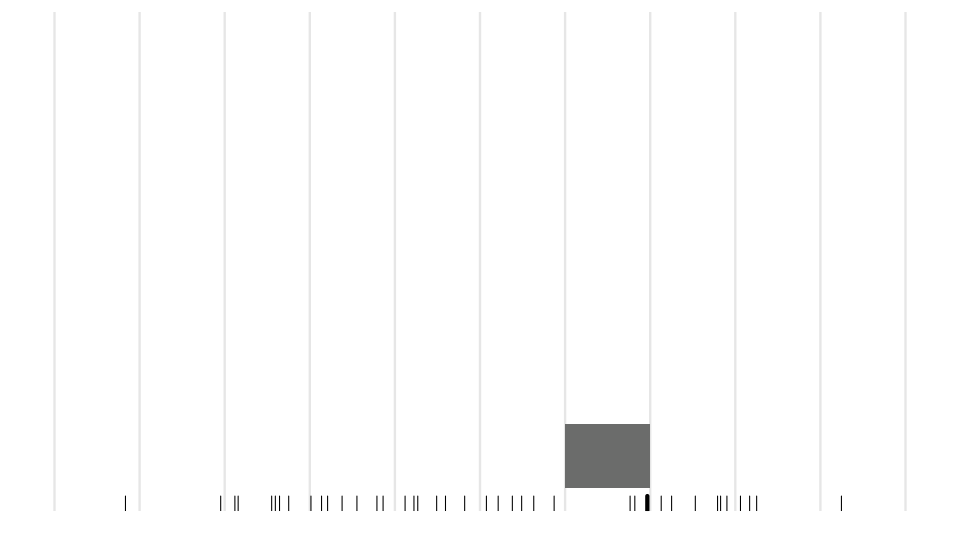

```{r setup, include=FALSE}
library(tidyverse)
library(palmerpenguins)
#data(package = 'palmerpenguins')
knitr::opts_chunk$set(echo = TRUE, comment = "")
knitr::opts_chunk$set(fig.dim=c(4.8, 4.5), fig.retina=2, out.width="100%")

set.seed(3) # reproducible
xaringanExtra:::use_freezeframe()
```

class: middle, inverse

## Learning outcomes

- Data types

- Numeric summaries

- Graphical summaries

---

## Data today

We'll use the *E. coli* count data from rivers in the Horizons Region again today.

```{r, message=FALSE}
hrc <- read_csv("https://www.massey.ac.nz/~jcmarsha/data/hrc/horizons_river_ecoli.csv")
hrc
```

These data are available from Land, Air, Water Aoteoroa, https://www.lawa.org.nz/download-data/

---

class: middle,inverse

# Data types

---

## Data types

There are two main types of data: quantitative and qualitative.

- Quantitative: Numeric measures, counts. Often continuous.

- Qualitative: Categories. Always discrete. Sometimes have an order.

---

class: middle,inverse

# Quantitative data

---

## Quantitative data

With quantitative data, or measure data, just about every value is potentially unique.

So tabling the data up (i.e. counting how many of each number we have) doesn't really make sense.

Instead, summarising the data needs to capture both where the data lies, the variation in the measure, and ideally how that variation occurs.

The key summaries are: **center**, **spread** and **shape**.

---

## Measures of center

The **center** of the data tells you about the scale that it is on, and where it's positioned on that scale.

By reducing data to it's center, comparing measures across groups reduces to comparing numbers. But obviously that hides a bunch of detail!

The most common measures of center are:

 - The arithmetic **mean**: Sum of the values divided by the number of values: $\bar{x} = \frac{1}{n} \sum_{i=1}^n x_i$.
 
 - The **median**: Order the values and take the middle one.
 
 - The **mode**: The most popular value (this can be tricky to define!)

---

## Robustness

Typically, the **median** is the most representative center.

It doesn't depend as much on the shape of the data as the mean does, and is often close to the **mode**, the most popular value. The median is always in the middle, regardless of shape.

The **mean** is far more convenient from a mathematical perspective but, as it depends on the values, it is strongly affected by shape or extreme values.

Any measure that is strongly affected by extreme values in the data is not **robust**.

The reason is that extreme values tend to be rare, and thus only pop up every now and then. Collecting another sample of data may result in the mean changing a bunch.

Let's create some data with an extreme value:

```{r}
dat <- tibble(x = sample(20, 20, replace=TRUE),
              y = c(100, x[-1]))
```

---

```{r}
dat
```

---

## Robustness

```{r}
summarise(dat, mean_x = mean(x), mean_y = mean(y),
          median_x = median(x), median_y = median(y))
```

The median of `x` and `y` are the same.

The means are not.

The mean of `y` is greatly affected by the extreme value.

---

## Robustness

```{r}
summarise(dat, mean_x = mean(x), mean_y = mean(y),
          median_x = median(x), median_y = median(y),
          trim_x = mean(x, trim=0.05), trim_y = mean(y, trim=0.05)) #<<
```

The median of `x` and `y` are the same.

The means are not.

The mean of `y` is greatly affected by the extreme value.

The **trimmed** mean, where we first remove 5% of the extreme values at either end, is more robust.

---

.left-code[
## Robustness
```{r}
summarise(hrc,
          median(Value),
          mean(Value))
```

```{r robust1, eval=FALSE}
ggplot(data = hrc) +
  geom_histogram(
    mapping = aes(
      x = Value
      )
    ) +
  scale_x_log10(
    labels = scales::label_comma()
  )
```
]

.right-plot[
```{r ref.label="robust1", echo=FALSE, message=FALSE}
```
]


---

.left-code[
## Robustness
```{r}
summarise(hrc,
        median=median(Value),
        mean=mean(Value, trim=0.05)) #<<
```

```{r robust2, eval=FALSE}
ggplot(data = hrc) +
  geom_histogram(
    mapping = aes(
      x = Value
      )
    ) +
  scale_x_log10(
    labels = scales::label_comma()
  )
```
]

.right-plot[
```{r ref.label="robust2", echo=FALSE, message=FALSE}
```
]

---


## Quantiles and quartiles

We can extend the concept of the median to be more general:

- The **median** is the value that appears 50% of the way through the ordered data.

- The **lower quartile** is the value that appears 25% of the way through the ordered data.

- The **upper quartile** is the value that appears 75% of the way through the ordered data.

- The **95th quantile** is the value that appears 95% of the way through the ordered data.

```{r}
summarise(hrc, lower = quantile(Value, 0.25),
          median = quantile(Value, 0.5), upper = quantile(Value, 0.75),
          `95th` = quantile(Value, 0.95))
```

---

## Measures of spread

- The **range** is the largest item minus the smallest item.

- The **interquartile range** is the upper quartile minus the lower quartile. This is more robust than the range.

- The **variance** is the averaged square distance of values to the mean.
$$
\sigma^2 = \frac{1}{n}\sum_{i=1}^n (x_i - \bar{x})^2
$$
- The **standard deviation** is the root mean square distance of values to the mean:
$$
\sigma = \sqrt{\frac{1}{n}\sum_{i=1}^n (x_i - \bar{x})^2}
$$
---

## Measures of spread

```{r}
summarise(hrc,
          range = max(Value) - min(Value),
          iqr = quantile(Value, 0.75) - quantile(Value, 0.25),
          sd = sd(Value),
          var = var(Value),
          mad = mad(Value))
```

The range, IQR and standard deviation and **median absolute deviation** are on the scale of the data.

The variance is on the scale of the data squared.

The IQR is more robust than the standard deviation.

The **median absolute deviation** is more robust again:

$$\textsf{median}(|x_i - \textsf{median}(x_i)|)$$

---

## Transformations

The mean works well if the data are relatively symmetric in shape.

If the data aren't relatively symmetric, then transforming the data to a different scale might make sense.

On the different scale the data might be closer to being symmetric, so we can then use the mean. We can then transform back to summarise on the original scale.

This allows us to use the more convenient mathematical properties of the mean while making sure we account for the lack of symmetry.

It basically works in the same way that axis transformations work for charting: we plot the transformed variables, but back-transform the axis labels.

```{r}
summarise(hrc,
          median = median(Value),
          mean = mean(Value),
          mean_from_log = exp(mean(log(Value))))
```

---

## Charts for numeric variables

There are lots of charts that summarise a single numeric variable well, but the three we'll look at are:

 - Histogram
 
 - Density plot
 
 - Boxplot

---

## Histogram

Divide the range of values into "bins" and then drop each value into the bin, counting as we go.

<div class='center-fig'>
  
</div>

---

.left-code[
## Histogram
Divide the range of values into "bins" and then count the number of values that fall in each bin.

```{r hist1, eval=FALSE}
ggplot(data = hrc) +
  geom_histogram( #<<
    mapping = aes(x = Value) #<<
    ) +#<<
  scale_x_log10(
    labels = scales::label_comma()
    )
```
]
.right-plot[
```{r, ref.label="hist1", echo=FALSE, message=FALSE}
```
]

---

.left-code[
## Histogram

The number of bins can change the plot shape, particularly on small data sets with rounded data, so it pays to experiment to make sure you are giving a fair representation.

```{r hist2, eval=FALSE}
ggplot(data = hrc) +
  geom_histogram(
    mapping = aes(x = Value),
    bins = 100 #<<
    ) +
  scale_x_log10(
    labels = scales::label_comma()
    )
```
100 bins is too many.

There is too much noise.
]
.right-plot[
```{r, ref.label="hist2", echo=FALSE, message=FALSE}
```
]

---

.left-code[
## Histogram

The number of bins can change the plot shape, particularly on small data sets with rounded data, so it pays to experiment to make sure you are giving a fair representation.

```{r hist3, eval=FALSE}
ggplot(data = hrc) +
  geom_histogram(
    mapping = aes(x = Value),
    bins = 10 #<<
    ) +
  scale_x_log10(
    labels = scales::label_comma()
    )
```
10 bins possibly are too few.

Some of the signal is lost.
]
.right-plot[
```{r, ref.label="hist3", echo=FALSE, message=FALSE}
```
]

---

## Histogram bin adjustment

<iframe src="https://shiny.massey.ac.nz/jcmarsha/histogram"  style="border: none" width="100%" height="500px"></iframe>

---

## Density

Drop a blob of jelly (**kernel**) where each value is. Where values are close (**density**) the jelly overlaps and builds up.

<div class='center-fig'>
  
</div>

---

.left-code[
## Density

Drop a blob of jelly (**kernel**) where each value is on the x-axis.

Where values are close (**density**) the jelly overlaps and builds up.

```{r dens1, eval=FALSE}
ggplot(data = hrc) +
  geom_density( #<<
    mapping = aes(x = Value) #<<
    ) + #<<
  scale_x_log10(
    labels = scales::label_comma()
    )
```

A smoothed version of a histogram.

The scale on the y-axis is such that the area
under the curve is 1.
]
.right-plot[
```{r, ref.label="dens1", echo=FALSE, message=FALSE}
```
]

---

.left-code[
## Density

A choice to make is the **bandwidth** which is basically how wide the jelly blob is.

You can adjust the default with the `adjust` multiplier.

```{r dens2, eval=FALSE}
ggplot(data = hrc) +
  geom_density(
    mapping = aes(x = Value),
    adjust=0.5 #<<
    ) +
  scale_x_log10(
    labels = scales::label_comma()
    )
```

A value less than 1 reduces bandwidth and you get more noise.
]
.right-plot[
```{r, ref.label="dens2", echo=FALSE, message=FALSE}
```
]

---

.left-code[
## Density

A choice to make is the **bandwidth** which is basically how wide the jelly blob is.

You can adjust the default with the `adjust` multiplier.

```{r dens3, eval=FALSE}
ggplot(data = hrc) +
  geom_density(
    mapping = aes(x = Value),
    adjust=2 #<<
    ) +
  scale_x_log10(
    labels = scales::label_comma()
    )
```
A value larger than one increases bandwidth and you potentially lose signal.
]
.right-plot[
```{r, ref.label="dens3", echo=FALSE, message=FALSE}
```
]

---

## Density bandwidth adjustment

<iframe src="https://shiny.massey.ac.nz/jcmarsha/kde"  style="border: none" width="100%" height="500px"></iframe>

---

## Boxplot

A boxplot reduces the data down to the **5 number summary**: The minimum, maximum, median, lower quartile and upper quartile.

```{r boxplot1, fig.dim=c(7,2), fig.retina=3}
ggplot(hrc) + geom_boxplot(aes(x=Value)) + scale_x_log10(labels = scales::label_comma())
```

In addition, any observations beyond a certain limit (1.5 box lengths away from the ends of the box) are marked individually as extreme observations.

---

## Boxplot: Skewness

We can infer some shape details from the boxplot by noting that the quartiles and median divide the data into quarters.

So a longer 'tail' at one end coupled with the box not being balanced suggests that the data are not symmetric.

```{r, echo=FALSE, fig.dim=c(7,1.5), fig.retina=3}
ggplot(hrc) + geom_boxplot(aes(x=Value)) + scale_x_log10(labels = scales::label_comma()) +
  theme_void() + labs(x=NULL, y=NULL)
```

These data would be described as **mostly** symmetric: the 'tail' on the right is longer due to the extreme values, but without them we'd call it symmetric.

We worry about (and comment on) lack of symmetry when it is really clear. If it's not really clear, no need to worry too much about it!

---

<iframe src="https://shiny.massey.ac.nz/jcmarsha/summer2019/student/?data=2"  style="border: none" width="100%" height="540px"></iframe>

---

class: middle,inverse

# Comparing across groups

---

## Comparing across groups

- For histograms and density charts the `fill` or `col` aesthetics can be used to separate groups.

- The `position` argument is useful for refining how multiple groups are placed for a histogram.

- Set `alpha` to make filled densities partially transparent.

- Boxplots can place groups next to each other using the `y` aesthetic.

- With many groups, switching the numeric variable to `y` works better.

- Generally, boxplots are better when you have many groups.

---

.left-code[
## Histogram by group

```{r comp1, eval=FALSE}
ggplot(data = penguins) +
  geom_histogram(
    mapping = aes(
      x = flipper_length_mm,
      fill = species #<<
      ),
    bins=12
    )
```

By default the histogram will **stack** bars.

This makes it hard to compare groups as the histograms don't all start at 0.
]
.right-plot[
```{r, ref.label="comp1", echo=FALSE, message=FALSE}
```
]

---

.left-code[
## Histogram by group

```{r comp2, eval=FALSE}
ggplot(data = penguins) +
  geom_histogram(
    mapping = aes(
      x = flipper_length_mm,
      fill = species
      ),
    bins=12,
    position = "dodge" #<<
    )
```

Using `dodge` for `position` will put the bars
side by side.

This breaks up the histogram so it still isn't all
that easy to read.
]
.right-plot[
```{r, ref.label="comp2", echo=FALSE, message=FALSE}
```
]

---

.left-code[
## Histogram by group

```{r comp3, eval=FALSE}
ggplot(data = penguins) +
  geom_histogram(
    mapping = aes(
      x = flipper_length_mm,
      fill = species
      ),
    bins=12,
    position = "identity", #<<
    alpha = 0.5 #<<
    )
```

Using `identity` for `position` will put the bars over the top of each other.

You need to add some transparency to see the ones underneath.
]
.right-plot[
```{r, ref.label="comp3", echo=FALSE, message=FALSE}
```
]


---

.left-code[
## Density by group

```{r comp4, eval=FALSE}
ggplot(data = penguins) +
  geom_density(
    mapping = aes(
      x = flipper_length_mm,
      col = species #<<
      ),
    )
```

Using `col` by group works.
]
.right-plot[
```{r, ref.label="comp4", echo=FALSE, message=FALSE}
```
]

---

.left-code[
## Density by group

```{r comp5, eval=FALSE}
ggplot(data = penguins) +
  geom_density(
    mapping = aes(
      x = flipper_length_mm,
      fill = species #<<
      ),
    alpha = 0.7 #<<
    )
```

`fill` by group maybe looks better?

Add some transparency by setting `alpha`.
]
.right-plot[
```{r, ref.label="comp5", echo=FALSE, message=FALSE}
```
]

---

.left-code[
## Boxplots by group

```{r comp6, eval=FALSE}
ggplot(data = penguins) +
  geom_boxplot(
    mapping = aes(
      x = flipper_length_mm,
      fill = species #<<
      )
    )
```

Setting `fill` will separate the groups out.

But the y-axis doesn't make sense.
]
.right-plot[
```{r, ref.label="comp6", echo=FALSE, message=FALSE}
```
]

---

.left-code[
## Boxplots by group

```{r comp7, eval=FALSE}
ggplot(data = penguins) +
  geom_boxplot(
    mapping = aes(
      x = flipper_length_mm,
      y = species #<<
      )
    )
```

Setting `y` instead works better.
]
.right-plot[
```{r, ref.label="comp7", echo=FALSE, message=FALSE}
```
]

---

.left-code[
## Boxplots by group

```{r comp8, eval=FALSE}
ggplot(data = penguins) +
  geom_boxplot(
    mapping = aes(
      x = species, #<<
      y = flipper_length_mm #<<
      )
    )
```

Having groups on `x` and the measure on `y` works
better for many groups.
]
.right-plot[
```{r, ref.label="comp8", echo=FALSE, message=FALSE}
```
]

---

.left-code[
## Boxplots by group

```{r comp9, eval=FALSE}
ggplot(data = penguins) +
  geom_boxplot(
    mapping = aes(
      x = species,
      y = flipper_length_mm,
      col = species #<<
      )
    )
```

Having groups on `x` and the measure on `y` works
better for many groups.

You can always colour them too `r emo::ji("smile")`
]
.right-plot[
```{r, ref.label="comp9", echo=FALSE, message=FALSE}
```
]

---

.left-code[
## Boxplots by group

```{r comp10, eval=FALSE}
manawatu <-
  filter(hrc,
    str_detect(Site, "manawatu")
    )
ggplot(data = manawatu) +
  geom_boxplot(
    mapping = aes(
      x = SiteID,
      y = Value,
      fill = SiteID
      )
    ) +
  scale_y_log10(
    labels = scales::comma
  ) +
  guides(fill = 'none')
```

With lots of groups a boxplot is best.
]
.right-plot[
```{r, ref.label="comp10", echo=FALSE, message=FALSE}
```
]
