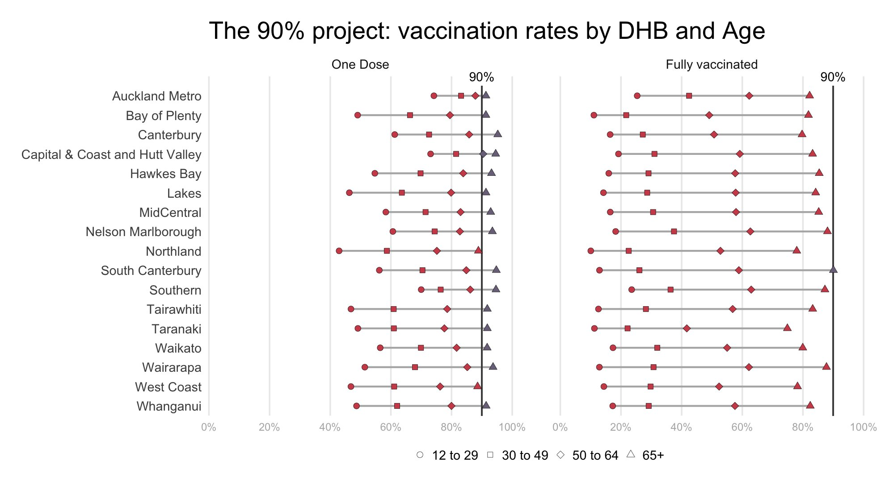
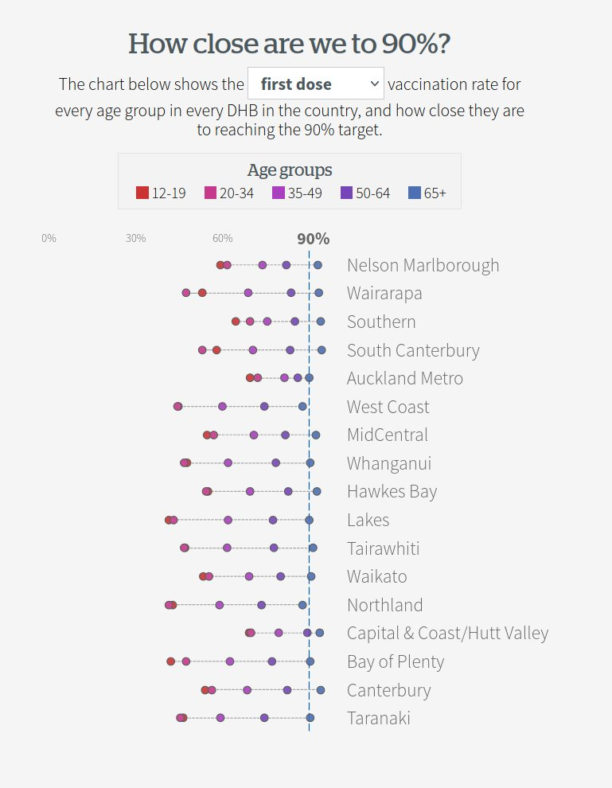
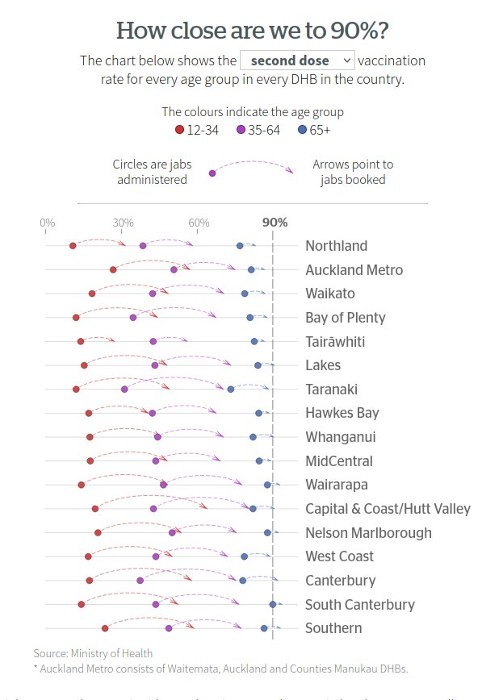

```{r setup, include=FALSE}
knitr::opts_chunk$set(echo = FALSE)
```

## Introduction

The big story in New Zealand (and the world) right now is COVID-19, and the arc that we're currently on is the journey to a vaccinated population.

Tracking how things are going is important, and the Ministry of Health in NZ has been supplying some excellent data on this. Every week they upload a new spreadsheet that contains **tidy** (This is a big deal for government supplied data!), long-form, machine readable worksheets with the number of doses given, broken down by age group, ethnicity, gender, District Health Board (DHB) and dose. You can grab the latest sheet from here if you'd like to have a go:

https://www.health.govt.nz/our-work/diseases-and-conditions/covid-19-novel-coronavirus/covid-19-data-and-statistics/covid-19-vaccine-data#download

This allows us to track the progress of vaccination really nicely!

### Part 1: My chart

I came up with the following effort:


which breaks down the vaccination rates by dose, DHB and age group, and compares them to a 90% target.

The code for this plot can be found here if you're interested: https://github.com/jmarshallnz/covid19nz/blob/main/dhb_90_project.R

### Part 0: The journey

This ofcourse took a bit of iteration, though the basic idea was one I had from the start - there was a lot of tuning
along the way though, as can be seen here, where I saved all the plots from the RStudio plot window.


### Part 2: Keith Ng's chart in the Herald

Keith Ng, a data journalist at the Herald contacted me after seeing the above chart on Twitter, and asked if he could reuse the idea behind it for a chart in the Herald.

He refined the chart, making it much cleaner, and made the dose selection interactive:

```{r, out.width='400px', fig.align = 'center'}

```

### Part 3: More data and the story changes

With more data becoming available on vaccination bookings also broken down by DHB, Age and Dose the story changed, and Keith did a great job of bringing this together:

```{r, out.width='400px', fig.align = 'center'}

```

<a href="
https://www.nzherald.co.nz/nz/covid-19-delta-outbreak-the-90-project-how-close-is-your-age-group-to-90/5GCQZMAJ7ABKQTDV4RNVL4QGRM/">Click here to read the article in the NZ Herald</a>.

I love this chart - the arrows give it a dynamic nature that really help tell the story: Instead of just being "this is where we are", the story now focuses on "this is the journey we're on". It highlights both the current situation, where we're quite far off the target in most groups, while also showing where things are heading, given that when you get dose 1 there's a big push to make sure you're booked in to dose 2. It helps tell a hopeful and positive story, while still highlighting that it's not enough to get where we want to be.

I really like the way Keith tells the story of his chart. Here's his Twitter thread:

```{r}
library(tweetrmd)
tweet_embed("https://twitter.com/keith_ng/status/1443405815369535493")
```
